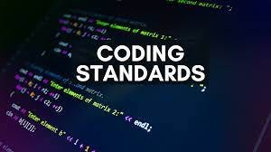

## Coding Standards: Guidelines for Good Code

Coding standards are thought of by many as trivial, nitpicky, and frivolous even. When thinking of coding standards, what comes to mind for many programmers is simply syntax. It is easy to forget, or to take for granted from the start, how important and outright essential clear communication and consistency can be - especially for programmers who may not have the best social and collaborative skills in their real life and school or work environment as well. However, coding standards are essential for code that is readable and maintainable collaboratively, for the creation of quality code in the first place, and even for learning the rules and use of a new programming language. 

## Growth as a programmer vs. - or because of - Coding Standards

Learning programming can be hard for some. The endless possibilities and ideas, contrasted with the lack of knowledge on how the programming language, or programming period, works, can be daunting. Coding standards help clarify for learners what the expectations are, and can help them to understand how the code works as well. My first programming teacher was most strict about appropriate naming and commenting, which have helped me to be able to understand my own code and share it with others, as well as to be able to identify when the naming practices or lack of comments make someone else's work harder for me to understand. For example, in ICS 212, there was a database project that included the use of memory addresses, and a variable for user's home addresses. Honomyms, words that have multiple meanings are perfect to illustrate the importance of apt naming and commenting. When discussing the concept with other students and our professor, it was easy to get mixed up and confused if we did not specify which "address" we meant, and so naming the home address variable more specifically and adding comments clarifying in the code helped prevent issues in writing the code and understanding it once written. 

Coding standards can also lead to the creation of more effient, quality code. A coding standard I have encountered that was challenging but rewarding is the controversial standard of only one return statement allowed per function. This often at least slightly changes the structure of the function, and can change the run time and memory used, depending on how much of the code is executed with only one return statement versus multiple. People have varying opinions on which way is more readable and understandable, but either way, setting clear coding standards between collaborators, or within a class or company, will aid in having consistent, effient, and readable code.
