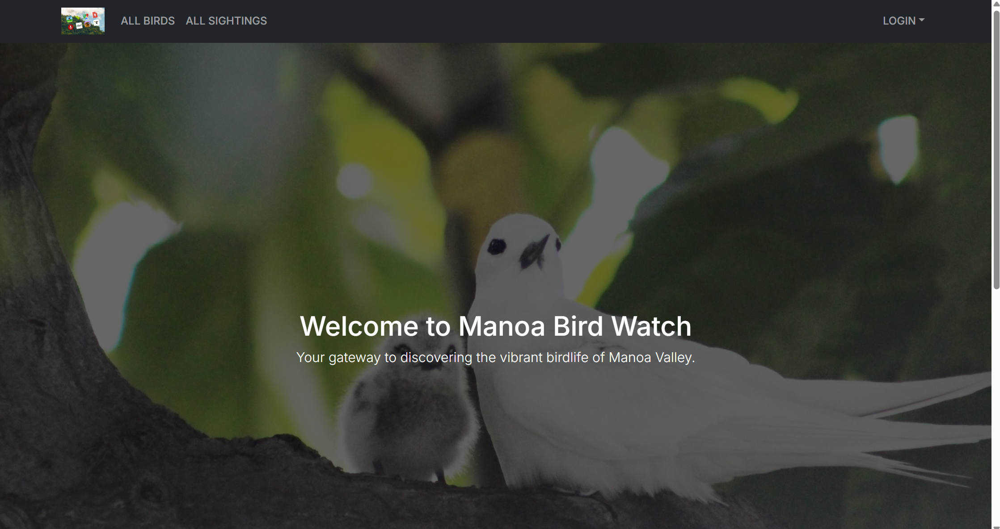

The homepage for this project can be accessed [here](https://manoa-bird-watch.github.io/). 
And the website itself is [here](https://m1-git-main-jeffrey8193s-projects.vercel.app/). 

The final project for ICS 314 software engineering was to create a Manoa-specific website in groups, using the software engineering skills we had learned throughout the course. My groups chose to create a website for bird watchers in Manoa. The website includes pages to discover the variety of birds that may be seen in Manoa, create an account or sign in, report a sighting, and view and comment on your own and other user's sightings. The unique aspect of this website compared with preexisting ones is the social aspect. Many bird watchers have a specific bird they have not yet seen or would like to see again, and would be interested in seeing where others have reported that bird can be seen in Manoa. 

To complete this project, everyone in my team took on roles we felt comfortable with. We had to program, coordinate the use of the database and deployment of the website, make the website visually appealing, and manage the project and document our progress. I took a mild leadership role in delegating tasks through out GitHub issues board, and checking in with my teammates on how we were each doing on our issues. I tackled an appropriate amount of the programming, by creating one of the pages and debugging others. In completing this project and the class it was for, I was reminded that I am not passionate about web development, and generally would rather someone else do it! The final project was also a good test of how much we each actually learned throughout the class, and where our weaknesses were. My weakness was with Vercel. However, I also appreciated my teammates and did enjoy the opportunity to get to know some of my classmates more. 

Here are some pictures of the current state of the website:
 
 
 
 
