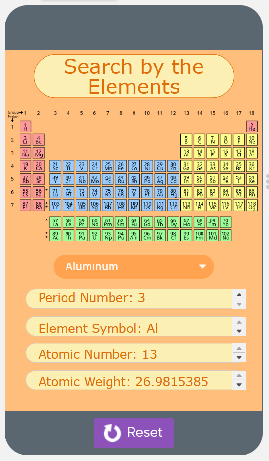

In 2022, my first computer science final project was a mobile app for Advanced Placement Computer Science Principles. Instruction and assignments for the class were on the platform [Code.org](https://code.org/), and this final project was also created on it. While "block coding" was an option, it was not used for this project. I and my pair coding partner created the concept and wrote the code for this app, using a dataset provided by Code.org.

The app can be accessed on Code.org [here](https://studio.code.org/projects/applab/BHQeNHHwuIj5tdBeS1uaiGLy5FaYIGPh-Fsv3e6F5t0).

Original code for the app:
``` javascript
//Originally created: February 16 2022, updated April 20 2022

//The Purpose of the App:
//The purpose of this app is to make it more convenient and efficient to find information on 
// certain elements the user is looking for
//(ie - period number, atomic number, symbol, and atomic weight)

//The lists below contain information from the data set,
//"Periodic Table elements," containing the information stated above on line 7

var elementNames = getColumn("Periodic Table Elements", "Name");
var periodNumbers = getColumn("Periodic Table Elements", "Period Number");
var elementSymbols = getColumn("Periodic Table Elements", "Symbol");
var atomicNumbers = getColumn("Periodic Table Elements", "Atomic Number");
var atomicWeights = getColumn("Periodic Table Elements", "Atomic Weight");

//The variables below contain the string/number that will be returned within each function 
//except for updateScreen. It will hold the information of the selected element.

var chosenPeriodNumber = 0;
var chosenElementSymbol = "";
var chosenAtomicNumber = 0;
var chosenAtomicWeight = 0;

//Below is a function called "periodNumber." It contains a
//for loop that will go through the periodic table data set of all of the
//element names. It will then use an if statement to find the element that
//the user selects. Once it finds the element, it will use the index number
//or i to return that element's period number using the period number list

function periodNumber(dropDown) {
  for (var i = 0; i < elementNames.length; i++) {
    var selectedName = elementNames[i];
    if (dropDown == selectedName) {
      chosenPeriodNumber = periodNumbers[i];
    }
  }
  return chosenPeriodNumber;
}

//Every function except for "updateScreen" should be a similar
//concept and formating as the "periodNumber" function

function symbol(dropDown) {
  for (var i = 0; i < elementNames.length; i++) {
    var selectedName = elementNames[i];
    if (dropDown == selectedName) {
      chosenElementSymbol = elementSymbols[i];
    }
  }
  return chosenElementSymbol;
}

function atomicNumber(dropDown) {
  for (var i = 0; i < elementNames.length; i++) {
    var selectedName = elementNames[i];
    if (dropDown == selectedName) {
      chosenAtomicNumber = atomicNumbers[i];
    }
  }
  return chosenAtomicNumber;
}

function weight(dropDown) {
  for (var i = 0; i < elementNames.length; i++) {
    var selectedName = elementNames[i];
    if (dropDown == selectedName) {
      chosenAtomicWeight = atomicWeights[i];
    }
  }
  return chosenAtomicWeight;
}

//Test 1:
//Should return 20.1797
//console.log(weight("Neon"));

//Test 2:
//Should return 63.546
//console.log(weight("Copper"));

//The onEvent for the dropdown that allows the user to pick an element 
//is below (line 91-96), the function updateScreen is called 
//because this is when the screen needs to be updated
//depending on user input via the drop down

onEvent("elementDropDown", "change", function( ) {
  //chosenElementName variable holds the string in the dropdown
  //(ie - the element the user selects)
  var chosenElementName = getProperty("elementDropDown", "text");
  updateScreen(chosenElementName);
});

//the function updateScreen is below which is where
//the screen will update with the correct information about the element
//by calling the previously made functions

function updateScreen(name) {
  setProperty("periodNumberText", "text", "Period Number: " + periodNumber(name));
  setProperty("elementSymbolText", "text", "Element Symbol: " + symbol(name));
  setProperty("atomicNumberText", "text", "Atomic Number: " + atomicNumber(name));
  setProperty("atomicWeightText", "text", "Atomic Weight: " + weight(name));
}
```
